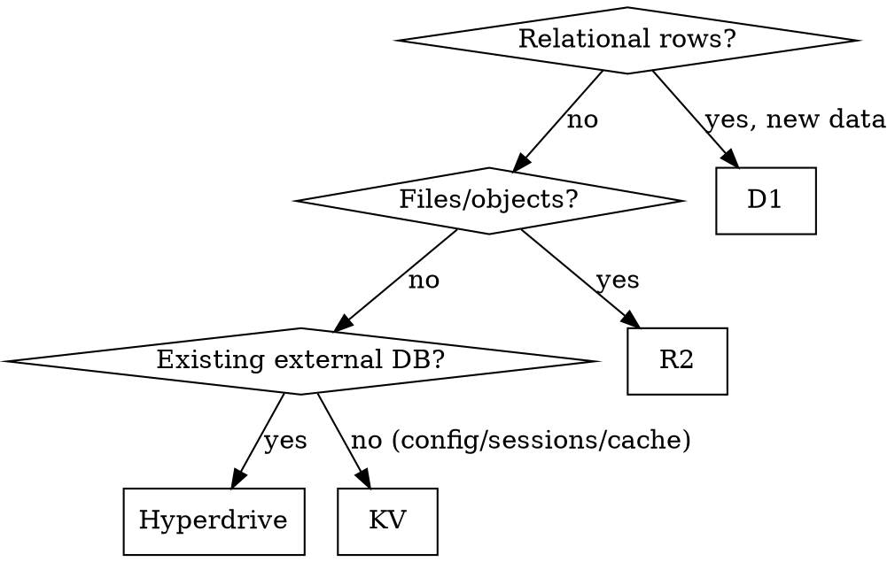

# cf-data (D1/KV/R2/Hyperdrive/Queues, Cloudflare-only)

## Overview

Pick the cheapest Cloudflare-native store and wire it as a binding (never REST from inside a Worker). Dominant proven stack from 120 audited projects: D1 (80) · R2 (71) · KV (53).

## When to Use

- New persisted state, file uploads, cache, sessions, migration off Postgres/MySQL/Redis/S3.
- When NOT: deploys (→ `cf-workers-deploy`), realtime coordination (→ `cf-realtime`).

## Implementation

Config sketch (`wrangler.jsonc`): `d1.databases`, `kv_namespaces`, `r2_buckets`, `hyperdrive`, `queues.producers/consumers`. Then `wrangler types`. Access via `env.DB/KV/R2` in-process. Queues for async/background work off the critical path; Pipelines for streaming ETL to R2.

Replacements (hard-refuse the left): self-hosted Postgres/MySQL → D1 or Hyperdrive; Redis → KV (cache/sessions) or Durable Objects (strongly consistent per-entity); S3/MinIO → R2; filesystem writes → R2 (Workers have no persistent disk). Python drivers (`asyncpg`/`aiomysql`) work over Hyperdrive's TCP sockets in Python Workers.

## Common Mistakes

- REST calls to Cloudflare APIs from inside the Worker instead of bindings.
- `await response.text()` on unbounded bodies — stream large payloads.
- KV for relational queries; D1 for blob storage; R2 for per-request counters.
- Forgetting `wrangler types` after adding a binding.

## Quota discipline (free tier: 100k rows written, 5M rows read/day)

- Verify with `COUNT(*)` and indexed lookups — never `SELECT *` dumps of large tables (one 20k-row dump costs 20k reads; a cross join can burn 100M+ in a single query and cap the account for a day).
- Never join without `ON`; sanity-check row estimates before running analytics on D1.
- Batch all verification into single statements; meter heavy jobs (`rows_read`/`rows_written` in every execute response) and stop when the day's budget is threatened.
- Split bulk seeds across UTC days so no single day exceeds ~95k writes.

## Reuses

`cloudflare` (`d1/`, `kv/`, `r2/`, `hyperdrive/`, `queues/`, `pipelines/` refs), `workers-best-practices` (bindings-over-REST, streaming). Official starters: `hyperdrive-demo`, `d1-northwind`.
