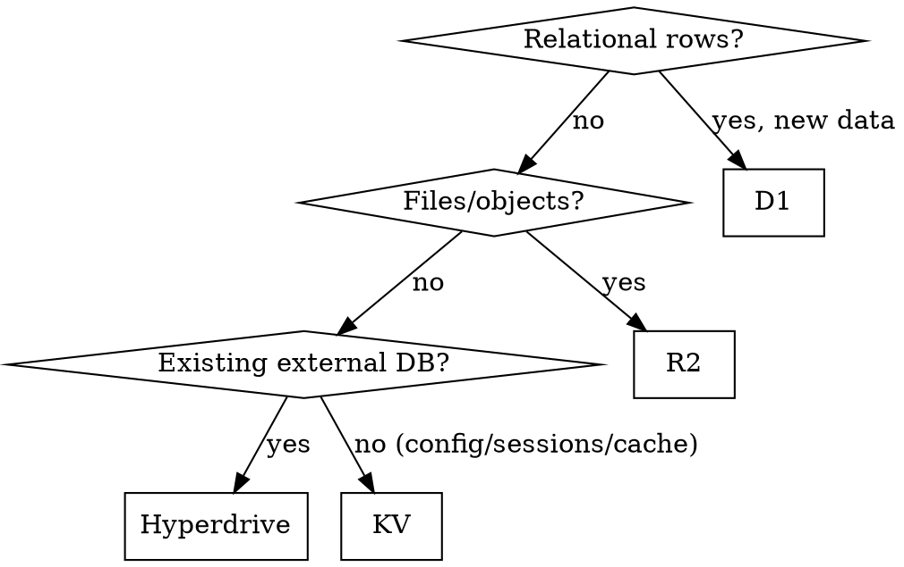

# cf-data (D1/KV/R2/Hyperdrive/Queues/Basin, Cloudflare-only)

## Overview

Pick the cheapest Cloudflare-native store and wire it as a binding (never REST from inside a Worker). Dominant proven stack from 120 audited projects: D1 (80) · R2 (71) · KV (53).

## When to Use

- New persisted state, file uploads, cache, sessions, migration off Postgres/MySQL/Redis/S3.
- When NOT: deploys (→ `cf-workers-deploy`), realtime coordination (→ `cf-realtime`).

## Implementation

```dot
digraph choice {
    "Relational rows?" [shape=diamond];
    "Files/objects?" [shape=diamond];
    "Existing external DB?" [shape=diamond];
    "D1" [shape=box];
    "R2" [shape=box];
    "Hyperdrive" [shape=box];
    "KV" [shape=box];
    "Relational rows?" -> "D1" [label="yes, new data"];
    "Relational rows?" -> "Files/objects?" [label="no"];
    "Files/objects?" -> "R2" [label="yes"];
    "Files/objects?" -> "Existing external DB?" [label="no"];
    "Existing external DB?" -> "Hyperdrive" [label="yes"];
    "Existing external DB?" -> "KV" [label="no (config/sessions/cache)"];
}
```

Config (`cloudflare.config.ts`, `bindings.*` — LSP-autocompleted): `bindings.d1/kv/r2/queue` (e.g. `DB: bindings.d1({ name: `mydb-${mode}` })`). Access via `env.DB/KV/R2` in-process. Queues for task handoff/background work off the critical path; K2 for durable ordered event streams; Basin Pipelines for streaming ETL into analytics tables.

Manage via `cf` (JSON default, `-q` for agents): `cf d1 list/get`, `cf d1 migrations create/apply`, `cf kv namespaces create/get`, `cf r2 …`, `cf queues …`, `cf cli search "basin …"` for Basin ops. Discover with `cf cli search "<action + resource>"`, details via `cf schema <cmd...>`. Wrangler equivalents (`wrangler d1 …`, `wrangler basin sql query`, `wrangler r2 bucket catalog enable`) remain as beta fallback.

Replacements (hard-refuse the left): self-hosted Postgres/MySQL → D1 or Hyperdrive; Redis → KV (cache/sessions) or Durable Objects (strongly consistent per-entity); S3/MinIO → R2; filesystem writes → R2 (Workers have no persistent disk); self-hosted warehouse/lake (Snowflake-S3, BigQuery, Kafka→warehouse) → Basin (open Iceberg tables, no egress fees). Python drivers (`asyncpg`/`aiomysql`) work over Hyperdrive's TCP sockets in Python Workers.

## Streaming with K2 (serverless event streams on R2)

When producers and consumers must decouple at the edge with durable, ordered, long-retention log streams — and Queues' task semantics don't fit — reach for K2, not a self-hosted broker (Kafka/Redpanda/NATS cluster). K2 is built directly on R2 object storage: no broker clusters to run, scale, or partition-manage. Rule of thumb: Queues = do-this-task-once background work; K2 = replayable ordered event log with many/slow consumers; Basin Pipelines = that log landing in queryable Iceberg tables. Product is brand-new (Birthday Week 2026) — verify binding/config verbs via `cf cli search "k2 …"` + docs MCP before citing them.

## Analytics with Basin (GA Oct 2026, formerly Cloudflare Data Platform)

OLTP rows live in D1; event-scale analytics lives in Basin — never scan millions of D1 rows for dashboards. Flow: **Basin Pipelines** (ingest via Workers bindings, HTTP endpoints, or Logpush; SQL transforms; sinks Iceberg tables or R2 files) → **Basin Catalog** (managed Apache Iceberg catalog inside your R2 bucket; standard Iceberg REST interface for Spark/Snowflake/DuckDB/PyIceberg; auto compaction + snapshot expiry) → **Basin SQL** (serverless distributed SQL over Catalog tables — JOINs, subqueries, multi-table CTEs; billed per compressed TB scanned). Tables stay portable and readable cross-cloud with zero egress fees. Verify exact `cf`/wrangler verbs via `cf cli search "basin …"` + docs MCP (names moved: Pipelines→Basin Pipelines, R2 Data Catalog→Basin Catalog, R2 SQL→Basin SQL).

Previews: same `id`/`database_id`/`bucket_name`/queue-name = shared data. Isolate by binding the Preview to a different resource (`previews.d1_databases` etc). Shared-staging pattern: base branch points `previews.d1_databases` at one staging DB and mirrors it in `wrangler.preview-migrations.jsonc` for `d1 migrations apply PREVIEW_DB --remote`; per-branch override hits both files.

## Common Mistakes

- REST calls to Cloudflare APIs from inside the Worker instead of bindings.
- `await response.text()` on unbounded bodies — stream large payloads.
- KV for relational queries; D1 for blob storage; R2 for per-request counters; D1 scans for event-scale analytics (use Basin).
- Forgetting to update `cloudflare.config.ts` bindings after adding a store (LSP should autocomplete `bindings.*`).
- Reaching for `wrangler` resource commands before trying `cf cli search`.

## Quota discipline (free tier: 100k rows written, 5M rows read/day)

- Verify with `COUNT(*)` and indexed lookups — never `SELECT *` dumps of large tables (one 20k-row dump costs 20k reads; a cross join can burn 100M+ in a single query and cap the account for a day).
- Never join without `ON`; sanity-check row estimates before running analytics on D1.
- Batch all verification into single statements; meter heavy jobs (`rows_read`/`rows_written` in every execute response) and stop when the day's budget is threatened.
- Split bulk seeds across UTC days so no single day exceeds ~95k writes.

## Reuses

`cloudflare` (`d1/`, `kv/`, `r2/`, `hyperdrive/`, `queues/`, `basin/`, `basin-pipelines/`, `basin-catalog/`, `basin-sql/` refs), `workers-best-practices` (bindings-over-REST, streaming). Official starters: `hyperdrive-demo`, `d1-northwind`.
